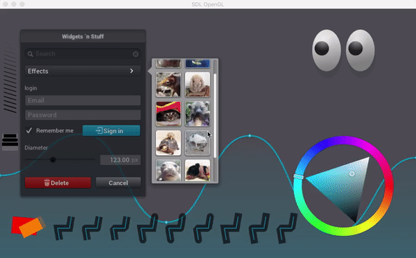

# `reason-wall-demo`

[](https://travis-ci.org/jordwalke/reason-wall-demo)

This project demonstrates using:

- [`Reason`](https://reasonml.github.io).
- [`esy`](https://github.com/esy/esy) (think "yarn for native")

to create a GUI application rendered with
[`wall`](https://github.com/let-def/wall) vector
drawing library.




## Build:

Make sure you have the latest [`esy`](https://github.com/esy/esy) installed (at
least version `0.0.52`):
```sh
npm uninstall -g esy
npm install -g esy@next
```

Clone, and then run these commands from the project directory:
```sh
esy install
esy build
```

**Now Run The App:**

```
./_build/default/bin/ReasonWallDemo.exe
```

## Release As `npm` Package:

The following commands create a prebuilt `npm` package exposing only the
`ReasonWallDemo.exe` binary.

```sh
esy release bin
cd _release/bin-darwin && npm publish --tag darwin
```

**Now Have Your Friend Try Out Your Released App:**

```sh
npm install -g reason-wall-demo@darwin
ReasonWallDemo.exe
```

## About Releases:

- `esy release` bundles your package and all its dependencies' dynamically
  loaded libraries and makes them usable on another computer via `npm install -g`.
- The `package.json`'s `esy.release.releasedBinaries`: Specifies which binary
  names you wish to export.
- The `package.json`'s `esy.release.deleteFromBinaryRelease`: Specifies which
  artifacts to strip out from the release. Make releases as lean as you want.

## Dependencies:
- The `package.json` `dependencies` field allows you to specify opam
  dependencies on any opam package by prefixing the package name with the
  `@opam/` scope.

### Origins:

`wall` is a port of NanoVG. `bin/ReasonWallDemo.re.re` is a conversion of the
example file from the `wall` repo. See `ORIGINS.md`.

### Troubleshooting:

Make sure your `esy` version is at least `0.0.52`.

```sh
esy --version
```
